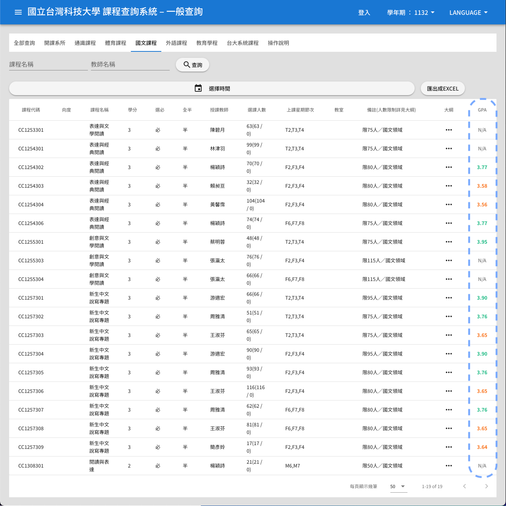
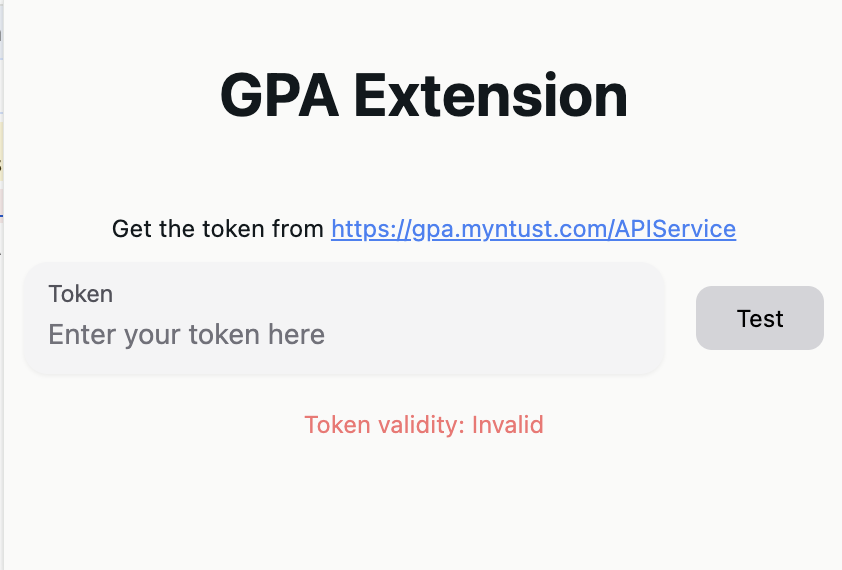
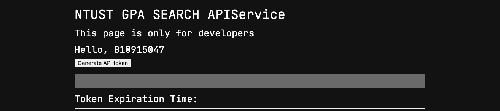

# NTUST GPA Chrome Extension
This is a Chrome extension that can show GPA information on the NTUST course information page.  
這是一個 Chrome 擴充功能，可以在 NTUST 課程資訊頁面上顯示 GPA 資訊。

---

## Installation / 安裝說明
1. Download the `dist.zip` from the [release page](https://github.com/chengpong1127/GPA-Extension/releases).  
   從 [發布頁面](https://github.com/chengpong1127/GPA-Extension/releases) 下載 `dist.zip`。

2. Unzip the `dist.zip` to a folder.  
   解壓縮 `dist.zip` 到一個資料夾中。

3. Open the Chrome browser and go to the Extensions management page or enter `chrome://extensions/` in the address bar.  
   打開 Chrome 瀏覽器，進到擴充功能管理介面，或是在網址列輸入 `chrome://extensions/`。

4. Enable the `Developer mode` on the top right corner.  
   在右上角啟用 `開發人員模式`。

5. Click the `Load unpacked` button and select the folder that you unzipped.  
   點擊 `載入未封裝項目` 按鈕，並選擇剛解壓縮的資料夾。

6. You will see the extension on the extension list.  
   你將在擴充功能清單中看到此擴充功能。

---

## Usage / 使用說明
### Set up the extension / 設定擴充功能
1. Click the extension icon on the top right corner of the browser.  
   點擊瀏覽器右上角的擴充功能圖示。

2. Enter [https://gpa.myntust.com/APIService/](https://gpa.myntust.com/APIService/), you may need to login with your NTUST account first.  
   進入 [https://gpa.myntust.com/APIService/](https://gpa.myntust.com/APIService/)，可能需要先登入 NTUST 帳號。

3. Click `Generate API token` button to get the API token.  
   點擊 `生成 API token` 按鈕來獲取 API token。

4. Enter the API token to the extension, make sure the extension shows `Token validity: Valid`.  
   將 API token 輸入到擴充功能中，確認擴充功能顯示 `Token validity: Valid`。  
   The token will expire in a few hours, and you need to generate a new token when it becomes invalid.  
   請注意，token 會在幾個小時後失效，失效後需要重新生成。

---

### Show GPA information / 顯示 GPA 資訊
1. Open the course information page on NTUST website: [https://querycourse.ntust.edu.tw/querycourse/#/](https://querycourse.ntust.edu.tw/querycourse/#/).  
   開啟 NTUST 的課程資訊頁面：[https://querycourse.ntust.edu.tw/querycourse/#/](https://querycourse.ntust.edu.tw/querycourse/#/)。

2. You will see a new column `GPA` on the page, with a column of search buttons.  
   在頁面上會出現一個新的 `GPA` 欄位，並包含一列搜尋按鈕。

3. Click the search button to fetch and show the GPA information of the course.  
   點擊搜尋按鈕即可獲取並顯示該課程的 GPA 資訊。

---

### GPA Display / GPA 顯示規則
- If the course is not found in the database, the GPA will be shown as `N/A`.  
  若資料庫中找不到該課程，GPA 顯示為 `N/A`。

- If the course is found in the database, the GPA will be shown as a number.  
  若資料庫中找到該課程，GPA 顯示為數字。

- Number color / 數字顏色：
  - Green: The GPA is higher than 3.7. / 綠色：GPA 大於 3.7。
  - Orange: The GPA is between 2.7 and 3.7. / 橙色：GPA 介於 2.7 至 3.7。
  - Red: The GPA is between 1.7 and 2.7. / 紅色：GPA 介於 1.7 至 2.7。
  - Purple: The GPA is lower than 1.7. / 紫色：GPA 小於 1.7。

---

### Known Issue / 已知問題
- Sometimes the GPA column would disappear, reloading the page would solve this problem.  
  有時候 GPA 欄位會消失，重新加載頁面即可解決此問題。

---

## Acknowledgements / 特別感謝
Special thanks to [myNTUST](https://gpa.myntust.com/) for providing the API that makes this extension possible.  
特別感謝 [myNTUST](https://gpa.myntust.com/) 提供 API，讓這個擴充功能得以實現。
