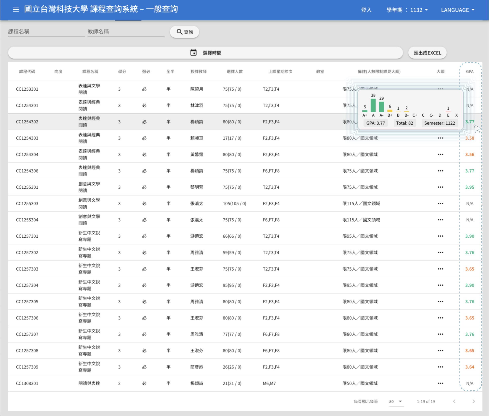
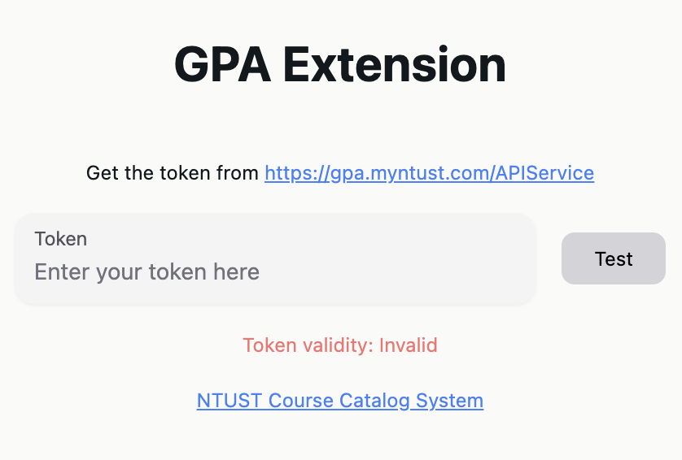

# NTUST GPA Chrome Extension
This is a chrome extension that can show GPA information on NTUST course information page.

## Installation
1. Download the `dist.zip` from the [release page](https://github.com/chengpong1127/GPA-Extension/releases).
2. Unzip the `dist.zip` to a folder.
3. Open the Chrome browser and enter `chrome://extensions/` in the address bar.
4. Enable the `Developer mode` on the top right corner.
5. Click the `Load unpacked` button and select the folder that you unzipped.
6. You will see the extension on the extension list.
## Usage
### Set up the extension
1. Click the extension icon on the top right corner of the browser.

2. Enter [https://gpa.myntust.com/APIService/](https://gpa.myntust.com/APIService/), you may need to login with your NTUST account first.
3. Click `Generate API token` button to get the API token.

4. Enter the API token to the extension, make sure the extension shows `Token validity: Valid`. The token will be expired in a few hours, you need to generate a new token when it's invalid.
   
### Show GPA information
1. Open the course information page on NTUST website: [https://querycourse.ntust.edu.tw/querycourse/#/](https://querycourse.ntust.edu.tw/querycourse/#/)
   
2. You will see a new column `GPA` on the page, with a column of search buttons.
3. Click the search button to fetch and show the GPA information of the course. 
### GPA Display
- If the course is not found in the database, the GPA will be shown as `N/A`.
- If the course is found in the database, the GPA will be shown as a number.
- Number color:
  - Green: The GPA is higher than 3.7.
  - Orange: The GPA is between 2.7 and 3.7.
  - Red: The GPA is between 1.7 and 2.7.
  - Purple: The GPA is lower than 1.7.
